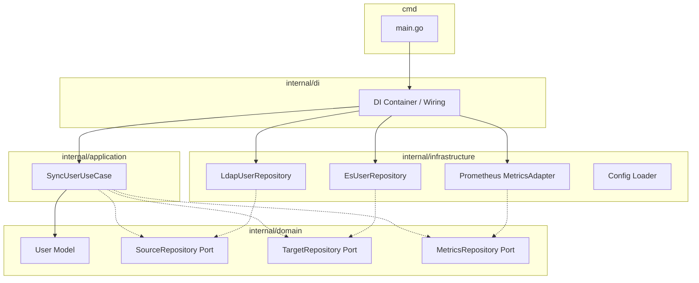

# LDAP to Elasticsearch Syncer (ldap-es-syncer)

`ldap-es-syncer` は、LDAP（Active Directory や OpenLDAP など）からユーザー情報を抽出し、Elasticsearch のユーザーインデックスに同期するための Go 製アプリケーションです。

---

## 🏗 アーキテクチャ概要

本アプリケーションは、ビジネスロジックと外部の具象技術（データベース、外部API、フレームワークなど）を分離し、保守性とテスト容易性を高めるために **Clean Architecture（Ports and Adapters）** に準拠して設計されています。



### レイヤー構成と役割
- **`cmd/`**
  - アプリケーションのエントリーポイント（`main.go`）です。シグナルハンドリングによる Graceful Shutdown や、デーモン起動制御を記述します。
- **`internal/di/`**
  - 各レイヤーの依存関係をワイヤリング（注入）する責務を持ちます。
- **`internal/domain/`** (Core Business Logic)
  - `model/`: `User` エンティティと、有効・無効化の判定などのピュアなドメインロジックを保持します。
  - `repository/`: 技術に依存しないポート（インターフェース）の定義です。
- **`internal/application/`** (Use Cases)
  - 同期処理（差分比較、論理削除、メトリクス記録）の流れを制御するユースケースを実装します。
- **`internal/infrastructure/`** (Adapters)
  - LDAP サーバーからのデータ取得（Go-LDAP）、Elasticsearch への反映（Elasticsearch Go SDK）、Prometheus 連携（Prometheus SDK）、環境変数ロードなど、技術固有の具体的な処理を担当します。

---

## 🚀 クイックスタート

### 1. 前提条件
- **Go**: 1.21 以上
- **Docker / Docker Compose**

### 2. 環境構築
1. プロジェクトルートにある `.env` ファイルを確認・調整します。
2. Docker Compose を使って OpenLDAP および Elasticsearch などの検証環境を立ち上げます：
   ```bash
   docker compose up -d
   ```
   > [!TIP]
   > このコマンドにより、OpenLDAP, phpLDAPadmin, Elasticsearch, Kibana, Prometheus, Pushgateway, Grafana が自動で立ち上がります。

3. アプリケーションを実行します：
   ```bash
   # ローカルで直接実行する場合
   go run cmd/main.go
   ```

---

## ⚙ 環境変数設定 (.env)

アプリケーションの動作は、`.env` ファイルを通じて制御されます。以下は主な設定項目です：

### アプリケーション実行制御 (`APP_`, `SYNC_`)
| 変数名 | 説明 | デフォルト値 / 設定例 |
| :--- | :--- | :--- |
| `APP_ENV` | 実行環境（`development`, `production`） | `development` |
| `APP_LOG_LEVEL` | ログ出力レベル（`debug`, `info`, `warn`, `error`） | `info` |
| `SYNC_DAEMON_MODE` | デーモンモード（`true`）またはワンオフ起動（`false`）の切り替え | `true` |
| `SYNC_INTERVAL` | デーモン実行時の同期間隔（例: `30s`, `1m`, `1h`） | `1h` |
| `SYNC_MIN_USERS` | 同期時のセーフティガード（取得ユーザー数がこれ未満なら同期を中止） | `1` |
| `ALERT_RULES_FILE` | Prometheusのアラートルールファイル | `alert.rules` |

### メトリクス・可観測性
| 変数名 | 説明 | デフォルト値 / 設定例 |
| :--- | :--- | :--- |
| `METRICS_ENABLED` | Prometheusメトリクスの有効化フラグ | `false` |
| `METRICS_PORT` | デーモンモード時のメトリクス公開ポート（HTTP GET `/metrics`） | `8081` |
| `METRICS_PUSHGATEWAY_URL` | ワンオフモード時の Pushgateway 送信先 URL | `http://localhost:9091` |

### LDAP 設定 (`LDAP_`)
| 変数名 | 説明 | デフォルト値 / 設定例 |
| :--- | :--- | :--- |
| `LDAP_URL` | LDAP サーバーの接続先 URL | `ldap://localhost:389` |
| `LDAP_BIND_DN` | LDAP 接続時のバインドDN | `cn=admin,dc=example,dc=org` |
| `LDAP_PASSWORD` | LDAP 接続パスワード | `admin` |
| `LDAP_BASE_DN` | 検索開始位置となるベースDN | `dc=example,dc=org` |
| `LDAP_SKIP_VERIFY` | TLS証明書検証をスキップするかどうか | `false` |
| `LDAP_FILTER` | ユーザー抽出のための LDAP 検索フィルター | `(&(objectClass=inetOrgPerson)(userPassword=*))` |
| `LDAP_MAP_UID` | IDマッピング元となる LDAP 属性名 | `uid` |
| `LDAP_MAP_USERNAME` | ユーザー名マッピング元となる LDAP 属性名 | `cn` |
| `LDAP_MAP_EMAIL` | メールアドレスマッピング元となる LDAP 属性名 | `mail` |

### Elasticsearch 設定 (`ES_`)
| 変数名 | 説明 | デフォルト値 / 設定例 |
| :--- | :--- | :--- |
| `ES_ADDRESSES` | Elasticsearch の接続アドレス（カンマ区切りで複数指定可） | `http://localhost:9200` |
| `ES_USERNAME` | 接続用の基本認証ユーザー名（セキュリティ無効時は省略可） | `elastic` |
| `ELASTIC_PASSWORD` | 接続用の基本認証パスワード（ミドルウェア公式名準拠） | `adminpassword` |
| `ES_INDEX_NAME` | 同期先インデックス名 | `users` |
| `ES_EXCLUDED_USERS` | 論理削除から保護する Elasticsearch 内のビルトイン/システムユーザー一覧 | `elastic,kibana_system...` |
| `ES_MAX_RESULTS` | 同期時の Elasticsearch 取得件数の上限 | `1000` |

---

## 🧪 テスト・検証アセットの利用

### テスト用 OpenLDAP データ
`test/ldap/bootstrap.ldif` に初期ユーザーデータおよびグループ（ロール）構造が定義されています。
Docker Compose の OpenLDAP 起動時に自動ロードされるように設定されており、以下の構造が構築されます：

- **ユーザーの格納先 (`ou=users,dc=example,dc=org`)**
  - グループ所属のあるテストユーザー 10 名 (`john.doe` 〜 `henry.gold`)
  - グループに所属しない単独ユーザー 1 名 (`solo.player`)
- **グループの格納先 (`ou=groups,dc=example,dc=org`)**
  - `cn=app_admin` (Adminロール、メンバー: `john.doe`, `bob.brown`)
  - `cn=app_user` (Userロール、メンバー: `jane.smith`, `alice.jones`, `charlie.green`, `david.white`, `eva.black`)
  - `cn=app_readonly` (ReadOnlyロール、メンバー: `frank.grey`, `grace.silver`, `henry.gold`)

> [!NOTE]
> グループの `objectClass` には `groupOfUniqueNames` を採用しており、ユーザーDNは `uniqueMember` 属性で紐付けられています。これにより、OpenLDAP の `memberOf` オーバーレイが自動連動し、ユーザーエントリに `memberOf` 属性が動的に付与されます。このため、`.env` 内の `LDAP_FILTER` で `memberOf` によるグループ絞り込みが有効に機能します。

### 監視ダッシュボード
`docker compose up -d` を起動すると、以下のダッシュボードを通じてアプリケーションのメトリクスを監視できます。
- **Prometheus**: `http://localhost:9090`
- **Pushgateway**: `http://localhost:9091`
- **Grafana**: `http://localhost:3000` (初期ID/Pass: `admin/admin`)
  - Grafana 起動時、`LDAP to ES Syncer Dashboard` が自動的にプロビジョニングされ読み込まれます。
